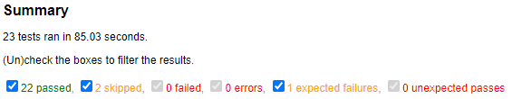

# AutomationPractice

Runs some test cases against http://automationpractice.com/index.php

Developed in **Python 3.8.5** so please use a compatible version.

## Installation

- For most IDEs (like PyCharm): just clone the project from git, and the IDE should help you install whatever is necessary.

- For Non-PyCharm users:
  1. Install a virtualenv. See https://packaging.python.org/guides/installing-using-pip-and-virtual-environments/
  2. Install the requirements
  
    ```
    pip3 install -r requirements.txt
    ```

## How To Run

**<u>For Non-PyCharm users</u>**

Run one of the following commands in Terminal:

- To run all the tests at the same time (parallelly):

    ```
    python -m pytest -n auto --html=report.html --self-contained-html
    ```

 - To run all the tests one at a time (sequentially):

    ```
    python -m pytest --html=report.html --self-contained-html
    ```

After pytest is finished running all the tests, an HTML report should be generated under the project working directory called *report.html*. If a previous *report.html* exists then it will be automatically overwritten.

<u>**For PyCharm users**</u>

- I saved the above commands as run configurations so they are automatically part of the project. The only difference is that the report will just be generated inside the [Tests folder](tests).

------

**The following is a screenshot of what should be expected in the report output:**



**Click [here](https://htmlpreview.github.io/?https://github.com/oxjoe/AutomationPractice/blob/main/example_report.html) to see a live preview of the example_report.html. Thanks to htmlpreview.github.io!**

## Notes

1. Test cases can be found in the [Tests folder](tests) and are laid out as per the self-explanatory filenames.
   - **List view and Grid view tests** are included as part of the [test_cart.py](tests/test_cart.py).
2. Since this is a technical exercise, I wrote these tests in a TDD way. If it was not, then I'd probably write these tests in a BDD way, so the business people would be able to see what is covered and what is not.
3. Most of the selectors I used were lenient and not very strict since its unlikely but <u>possible</u> that the site could be updated at anytime.
4. While it is a better practice to keep locators in separate classes, in this case it makes more sense to include locators inside each Page Object Model (POM) for readability since this is a simpler project.
5. If you get a **Resource Limit Is Reached** error from the site then please just run the tests again.
   - I encountered this error a lot during the day however the site seems to be fine during the evenings.
   - Also try running the tests sequentially rather than parallelly.

## General Observations About The Site

- If user is logged in and adds an item to their cart, the cart information is not saved when logging out. So when the user logs back in, their cart will be empty.
- T-shirts shouldn't actually be a header item. It makes more sense for it to be Tops so Blouses would be covered under this section.
- Everything is in stock, so I can't test an out-of-stock scenario.
- The color selected doesn't actually match the color of the item in the example picture for some items.
- Add to cart shouldn't be a popup that requires you to x out, it should be like a side window like every other shopping website.
- Can't change the size when you add to cart  (basically a default size is picked for you when you add to cart).
- Clicking on a specific color opens a new window. It should just change the color in the thumbnail like every other shopping website.
- Probably better to include the product number/SKU when you add it to the cart since there are multiple items with the same name. There's two products called "Printed Dress".
- If an item is already in the cart, and you add it again, it's not clear in the cart popup how many total items you've just added b/c it shows previous items too.
- Elements have weird spacing issues like Add to Wishlist and Quantity in the Cart Window that appears after adding an item.
- In the Sign In, it allows you to keep trying the same password over and over again which is not good.
- In the Cart Summary Page
  - If I add neg numbers, then it returns the abs value.
  - If I put in 0 it returns Null quantity.
  - If I put in strings it returns Null quantity.
  - If I leave it blank it assumes 1.
  - If I put in space it returns Null quantity.
  - Too many things to list. If I had to automate this I'd use a library like Hypothesis to check stuff.

